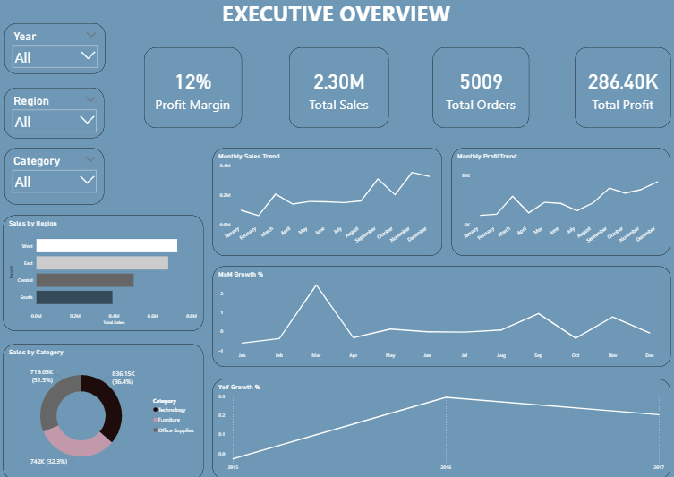
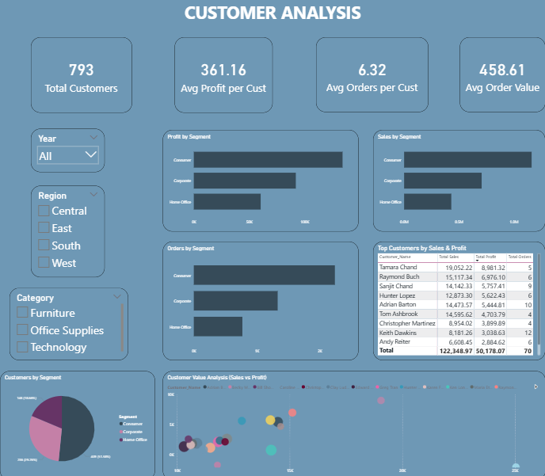
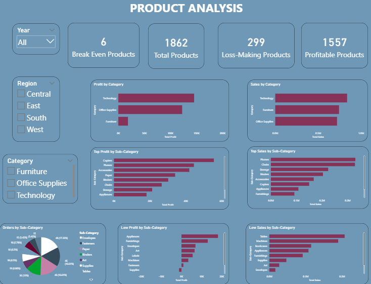
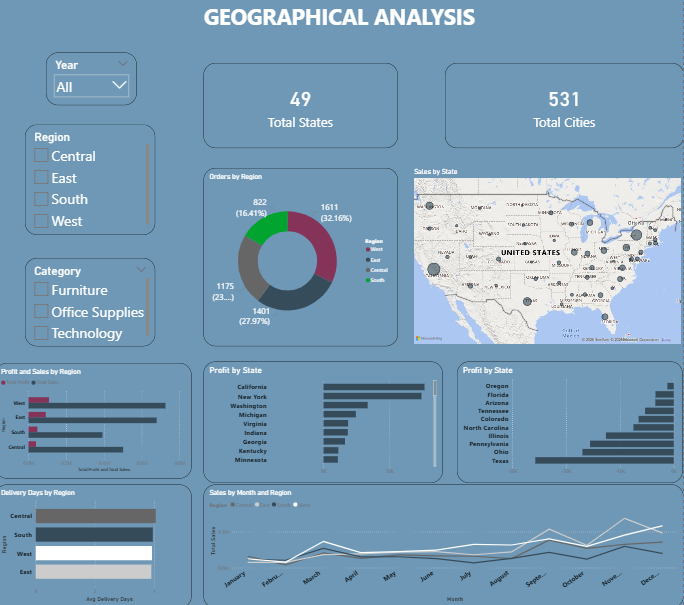
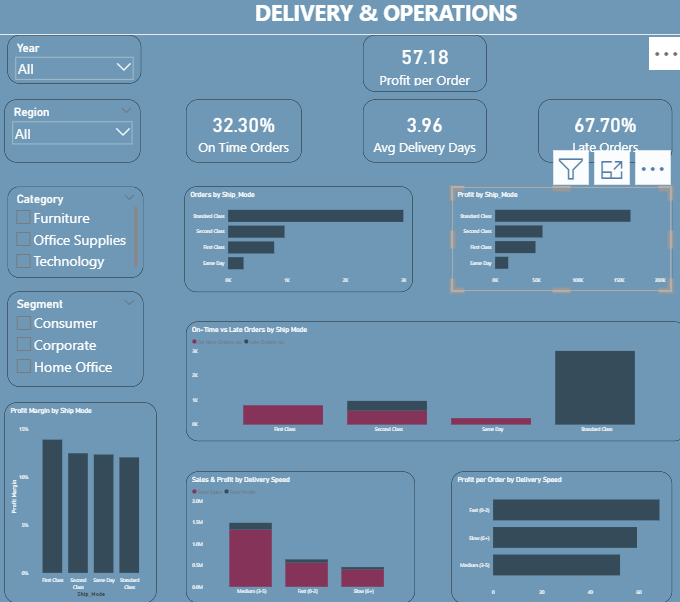

### Superstore-sales-analysis
Analyzed retail sales data to uncover profit drivers and inefficiencies using Python, SQL, and Power BI. Identified loss-making categories, discount impact on margins, and regional trends, delivering actionable insights through an interactive dashboard.

## 📸 Dashboard Preview

### Executive Overview

### Customer Analysis

### Product Insights

### Geography Analysis

### Operations Analysis

### Operations Analysis

